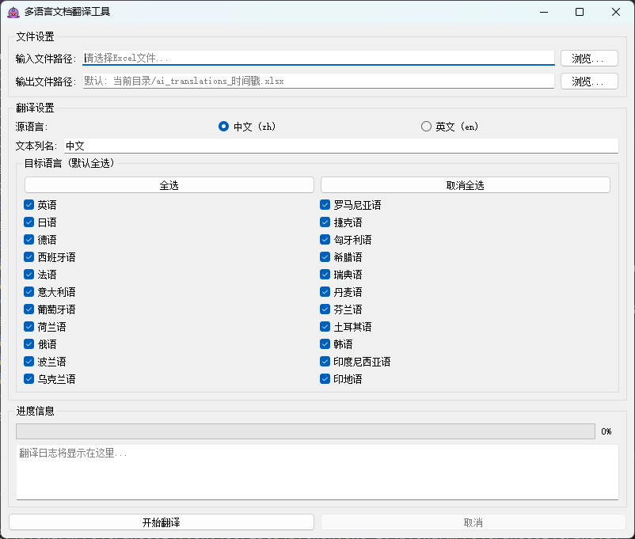
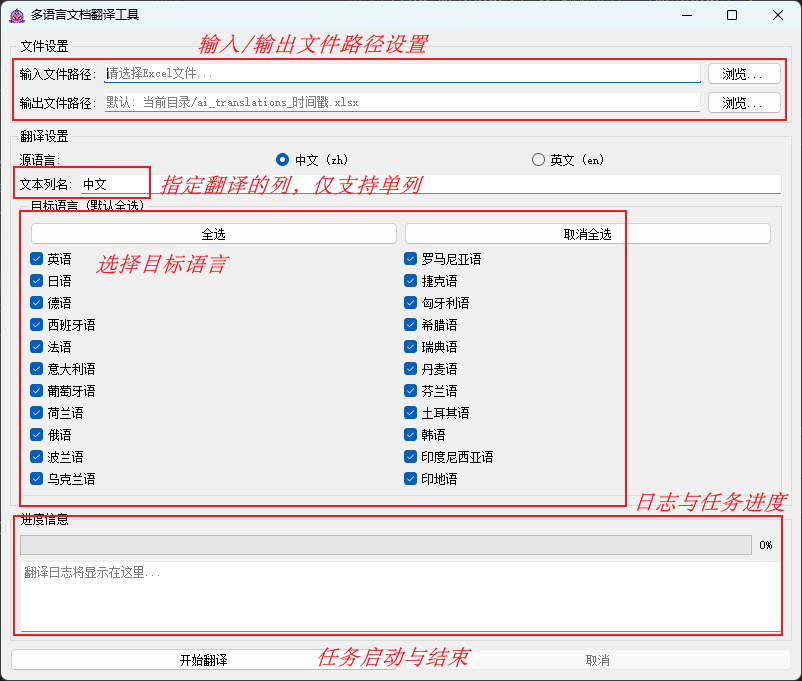
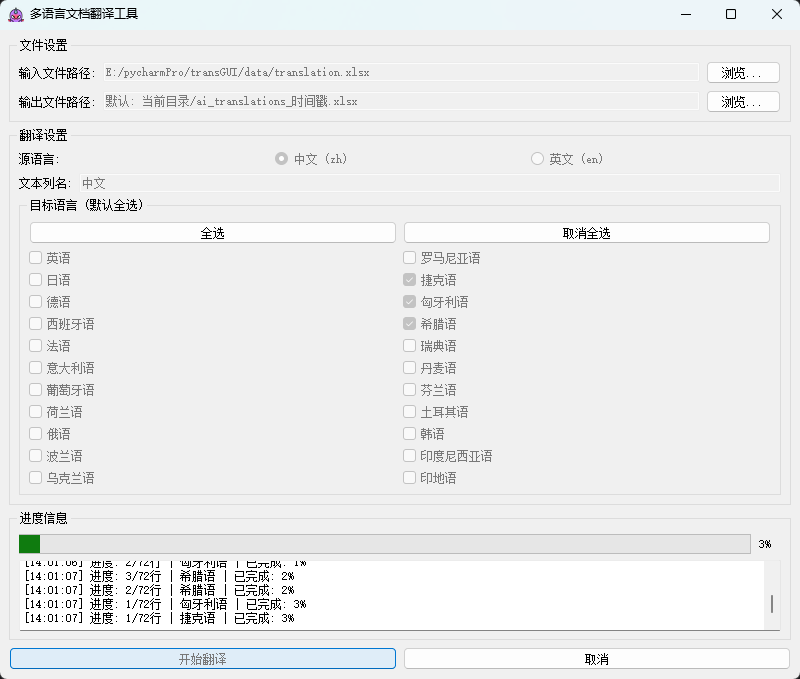

# 多语言文档翻译工具使用指南



## 工具简介

本工具是一款基于 PyQt5 的 Excel 文档多语言批量翻译软件，支持 23 种语言，自动保持原表结构，适用于技术文档、产品说明等多场景。

---

## 主要功能

- **批量翻译 Excel 文档**，支持 `.xlsx` 和 `.xls` 格式
- **多目标语言**，一次可翻译为多种语言
- **进度条与实时日志**，翻译过程透明可控
- **任务取消**，随时终止翻译
- **自动列名切换**，源语言变更时智能调整

---

## 系统要求

| 项目         | 说明                |
| ------------ | ------------------- |
| 操作系统     | Windows/MacOS/Linux |
| Python版本   | 3.7 及以上          |
| 内存         | ≥4GB（推荐8GB+）    |

---

## 安装步骤

1. **安装依赖**

   ```bash
   pip install -r requirements.txt
   ```

   主要依赖：
   - PyQt5
   - pandas
   - aiohttp
   - python-dotenv

2. **配置 API 密钥**

   在项目根目录新建 `.env` 文件，内容如下：

   ```
   TRANSLATION_API_KEY=你的API密钥
   TRANSLATION_API_URL=https://你的API地址
   MAX_CONCURRENT_REQUESTS=5
   ```

---

## 使用方法

### 1. 启动程序

双击 `trans.py` 或命令行运行：

```bash
python trans.py
```

### 2. 主界面说明



- **文件设置区**  
  - 输入文件路径：选择待翻译的 Excel 文件  
  - 输出文件路径：指定保存位置（可选）

- **翻译设置区**  
  - 源语言：选择原文语言（中文/英文）
  - 文本列名：填写需翻译的列标题
  - 目标语言：勾选需要翻译的语言（支持全选/取消全选）

- **进度信息区**  
  - 进度条：显示翻译进度
  - 日志：实时显示状态与错误

- **操作按钮**  
  - 开始翻译：启动任务
  - 取消：中止任务

---

### 3. 基本流程

1. **准备 Excel 文件**  
   确保有待翻译文本的列

2. **选择输入文件**  
   点击“浏览...”选择 Excel 文件

3. **设置输出路径**  
   可选，默认自动生成

4. **选择源语言**  
   根据原文内容选择

5. **填写文本列名**  
   与 Excel 表头一致

6. **选择目标语言**  
   勾选需要的语言

7. **开始翻译**  
   点击“开始翻译”，等待进度完成

8. **查看结果**  
   翻译完成后在指定位置查看 Excel 文件

---

## 支持的目标语言

| 代码 | 语言         | 代码 | 语言         |
| ---- | ------------ | ---- | ------------ |
| EN   | 英语         | SV   | 瑞典语       |
| JA   | 日语         | DA   | 丹麦语       |
| DE   | 德语         | FI   | 芬兰语       |
| ES   | 西班牙语     | TR   | 土耳其语     |
| FR   | 法语         | KO   | 韩语         |
| IT   | 意大利语     | ID   | 印度尼西亚语 |
| PT   | 葡萄牙语     | HI   | 印地语       |
| NL   | 荷兰语       |      |              |
| RU   | 俄语         |      |              |
| PL   | 波兰语       |      |              |
| UK   | 乌克兰语     |      |              |
| RO   | 罗马尼亚语   |      |              |
| CS   | 捷克语       |      |              |
| HU   | 匈牙利语     |      |              |
| EL   | 希腊语       |      |              |

---

## 常见问题与解决

- **文件读取失败**  
  检查路径、文件未被占用

- **API调用错误**  
  检查 `.env` 配置与网络

- **列名不匹配**  
  确认列名与 Excel 表头一致（区分大小写和空格）

---

## 获取帮助

如遇问题，请提供：

- 错误日志截图
- Excel 文件样例（如可提供）
- 软件版本信息

---

## 版本信息

- 当前版本：1.0
- 最后更新：2024年1月
- 开发者：GUI翻译工具团队

> 本工具依赖外部翻译API服务，翻译质量取决于API供应商。建议先小规模测试。

---

